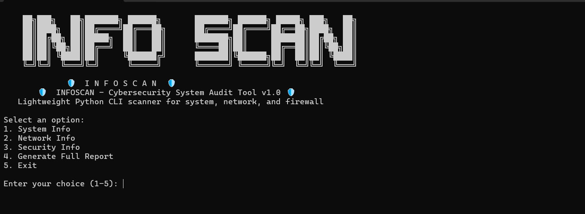
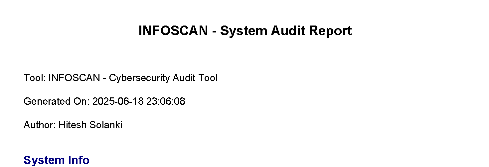

<h1 align="center">
  🛡️ INFOSCAN 🛡️<br>
  <sub>Cybersecurity System Audit CLI Tool</sub>
</h1>

<p align="center">
  🔍 Lightweight Python tool to scan and audit your system, network, and security environment — with professional PDF reporting.
</p>

<p align="center">
  
  
  
</p>

---

## 📸 Screenshots

| CLI Menu | Report Example |
|----------|----------------|
|  |  |


---

## 🚀 Features

- ✅ Collect System Information (OS, CPU, RAM, etc.)
- 🌐 Retrieve Network Info (Local IP, Public IP, Interfaces, DNS, Gateway)
- 🔒 Perform Basic Security Checks (Firewall, running processes)
- 📝 Export a detailed, timestamped **PDF Report**
- 🧠 CLI menu design inspired by **Kali Linux** tools

---

## 📦 Installation

```bash
# Clone the repository
git clone https://github.com/hitehsolanki2006/INFOSCAN
cd INFOSCAN

# Install dependencies
pip install -r requirements.txt

# Run the tool
python main.py


